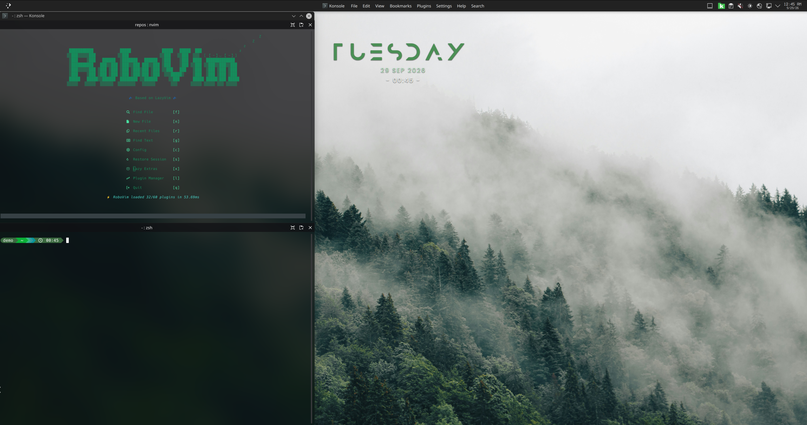

<p align="center">
  
</p>
git pu
<p align="center">
  <a href="https://github.com/ironlegit/undergrowth-arch/tags"></a>
  <a href="https://sonarcloud.io/dashboard?id=ironlegit_undergrowth-arch"></a>
  <a href="https://sonarcloud.io/dashboard?id=ironlegit_undergrowth-arch"></a>
  <a href="https://sonarcloud.io/dashboard?id=ironlegit_undergrowth-arch"></a>
  <a href="https://sonarcloud.io/dashboard?id=ironlegit_undergrowth-arch"></a>
</p>


# 🌲 Undergrowth-Arch 🌲

This is a KDE Plasma-based VM configuration for development work built on Arch Linux. It was primarily built to be used as a VM in VMware Workstation Pro, but should also work on its own. The desktop environment is based on a minimal KDE Plasma installation (see `group_vars/local.yml` &rarr; `kde_packages`) with no media features, communication tools, or office applications except LibreOffice. The theme is organic and sylvan, centered on this aesthetic.

This setup focuses on development centered on Zsh, LazyVim, and Lazygit.

> [!IMPORTANT]
> This setup is highly specialized and opinionated.

# Disclaimers

This playbook installs AUR packages without explicitly checking them. If you want to be sure scan the packages using [AUR Security Scanner](https://github.com/KiefStudioMA/ks-aur-scanner), which funnily enough is also an AUR package.

# 1. VMware Image Setup

## 1.1 Get Arch Linux Image

- Get ISO and signature files from an official [Arch Linux Repo](https://archlinux.org/download/).
- Follow instructions to check checksums and signature.

## 1.2 VMware Setup

- `File > New Virtual Machine`
- **Virtual Machine Configuration:** Typical
- **Install operation system from:** Installer disc image file (iso)
- **Guest Operation System**: Linux
- **Kernel:** Other Linux 6.x kernel 64-bit
- Name and location of VM.
- **Disk Size:**
    - Be generous, e.g. 150GB (doesn't block 150GB of space)
    - Store virutal disk as single file
- Memory and Processor depend on host.

After completing the wizard, go to "Edit virtual machine settings":

**Hardware Tab**
- **Display:**
    - Accelerated 3D Graphics
    - Recommended graphics memory
    - Strech mode and keep aspect ratio

**Options tab**
- `Advanced > Firmware type`: UEFI
- **Guest isolation**
    - Enable drag and drop
    - Enable copy and paste

Start the VM.

**Note**: If keyboard input is very laggy, [try this](#sluggish-keystrokes-in-vmware-workstation).

# 2. Archinstall

Open `archinstall` or manual installation (not described here).

A concise `archinstall` configuration for a standard Arch Linux setup:

- **Keyboard layout:** `de_CH-latin1` (or not)
- **Firewall:** UFW
- **Bootloader**: systemd-boot
- **Authentication**:
  - Root password
  - One user with sudo privileges
- **Profile**: None or minimal
- **Network backend:** NetworkManager (default backend)
- **Additional packages:**
  - Ansible
  - Python
  - vim
- **Partitioning:**
  - Use best-effort partitioning for simple dev-VM, else go for LVM.
    - If using "best-effort" setup, do not create a separate `/home` partition
  - Use `ext4` filesystem
  - Enable full-disk encryption with LUKS
  - Use default swap configuration.

Useful guide: https://computingforgeeks.com/install-arch-linux-archinstall/

# 3. Ansible

The ansible playbook covers post-installation configuration for Arch Linux in a VMware environment.

**Caveat**: 
* The `dev-tools` role is very tailored to my liking.
* Review the `aur-setup` role and  decide whether you're comfortable proceeding with it.

## 3.1 What This Does

- Updates pacman and system packages
- Installs and configures VMware tools (only `playbook-arch-vmvare.yml`)
- Installs hardware accelerated graphics (Mesa)
- Installs KDE Plasma desktop with selected applications
- Sets up AUR access and installs AUR packages

## 3.2 Requirements

If not already done during `archinstall`:
- Arch Linux with sudo access for current user
- Ansible installed: `sudo pacman -S ansible`
- Git: `sudo pacman -S git`

## 3.3 Dry-run

Test run playbooks:

```
ansible-playbook -i inventory playbook-arch-vmware.yml --ask-become-pass --check -v
``` 

## 3.4 Usage

Run all playbooks:

```bash
ansible-playbook -i inventory playbook-arch-vmware.yml --ask-become-pass -vv
```

Run specific roles, e.g.:
```bash
ansible-playbook -K playbook-arch-vmware.yml --tags kde --ask-become-pass -v
ansible-playbook -K playbook-arch-vmware.yml --tags pacman-update --ask-become-pass -v
```

For all available tags, check `ansible-playbook playbook-arch-vmware.yml --list-tags`.

# 4. KDE Theme

To adopt the KDE Plasma theme, run the corresponding playbook:

```bash
ansible-playbook -i inventory playbook-desktop-theme.yml --ask-become-pass -v
``` 

It's an adaptation of the Darkly KDE theme with a sylvan twist.

**Wallpaper shoutout**: Photo by <a href="https://unsplash.com/@rasmusgs?utm_source=unsplash&utm_medium=referral&utm_content=creditCopyText">Rasmus Gundorff Sæderup</a> on <a href="https://unsplash.com/photos/a-forest-of-trees-379eC1vAJZA?utm_source=unsplash&utm_medium=referral&utm_content=creditCopyText">Unsplash</a>

## 4.1 Update KDE dotfiles

Run this shell script to update the Jinja templates.
```bash
./tools/update_kde_dotfiles.sh 
```

# 5. Troubleshooting

## Sluggish keystrokes in VMware Workstation

Open `<vm-name>.vmx` in VM folder and add this line:

```{bash}
keyboard.vusb.enable = "TRUE" # no keyboard input lag
```

## Copy-paste issue with VMware Workstation

Copy-pasting from host to guest (VMware) or vice-versa does not work. 

* Issue: https://github.com/vmware/open-vm-tools/issues/792
* The clipboard sharing (copy & paste) and drag & drop between VMware host and guest do not function when the guest is running a Wayland session. open-vm-tools only supports copy & pasting in X11 sessions.


**Solution**:

Install patched version of Open VM Tools https://github.com/krisztianfekete/clipway

```{bash}
paru -S open-vm-tools-clipway

# Add to shell-rc-file
XDG_SESSION_TYPE=wayland vmtoolsd -n vmusr &
```
